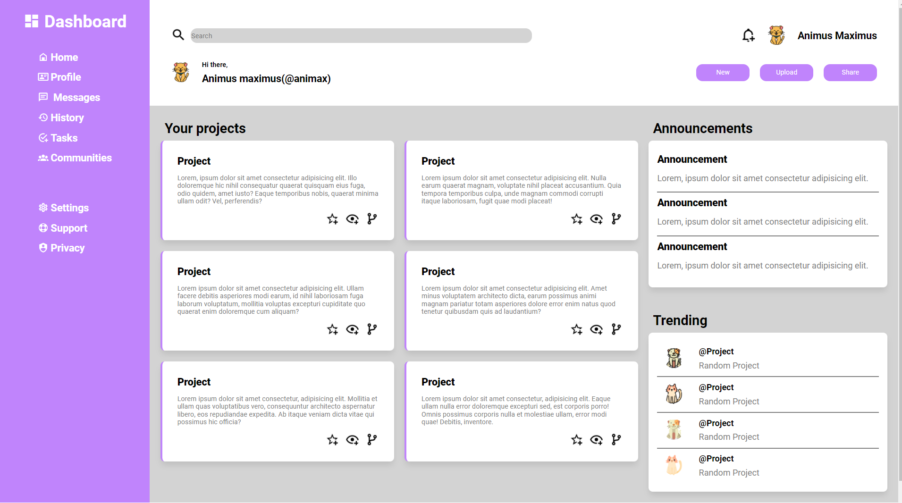

# Admin Dashboard Project

In this project we are creating an admin dashboard using more advanced CSS and HTML, specifically CSS grid. Offering the advantage of having 2 dimensional layouts this project emphasizes on using CSS grid to create it. 

The Odin Project Link : [Link](https://www.theodinproject.com/paths/full-stack-javascript/courses/intermediate-html-and-css/lessons/admin-dashboard)

## Topics learnt before starting the project

1. CSS Grid
2. Creating Grids
3. Positioning grids and some advanced grid properties
4. What CSS grid offers over FlexBox and where should we use which.

## Challenges faced

1. Faced a major issue with making the grid match what the design layout image showed. Took a week to figure out the grid dynamics and moved to using free space templates for designing the page.
2. Another major still, working on is the lack of design standards. I plan to give a the BEM styling guide a shot in hopes of improving my CSS files.

Live Link : [Here](https://ankur26.github.io/admin-dashboard-page/)

This was what was given as a reference design - credit to the Odin Project
 

 
This is what I have done in my final design given that the project allows a bit of creative liberty
 

 
